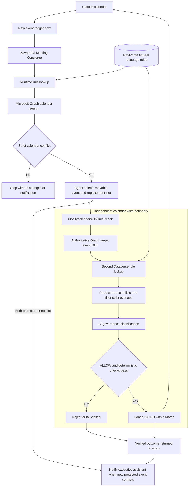

# Zava ExM Meeting Concierge

## Overview

I built Zava ExM Meeting Concierge to explore a practical governance problem: how do we let an AI agent reason about calendar changes while keeping the final write decision in a separate enforcement path?

This proof of concept uses one Copilot Studio agent, two Power Automate flows, Microsoft Graph, and natural-language rules in Dataverse. The agent identifies conflicts and proposes a new time. **Every calendar write goes through `ModifycalendarWithRuleCheck`, which reads the event and policy again before allowing a change.**

This repository contains the actual unmanaged solution exported from Zava PP Lab Dev on October 1, 2026, plus human-authored architecture and implementation notes. It is a demonstrated lab implementation, not a production-readiness claim.

---

## Design Rationale

In enterprise environments, generative models and LLM agents operate probabilistically. While valuable for intent classification, entity extraction, and conversational synthesis, **unconstrained agents must never possess direct mutation rights (write/update/delete) on core enterprise systems of record**. 

If business rules are embedded directly into prompt instructions, systems become vulnerable to:
1. **Prompt injection & jailbreaking** (malicious or unintended user prompts overriding rules).
2. **Instruction drift & hallucination** (model probabilistic variance causing rule bypass).
3. **Rigid deployment cycles** (requiring AI engineers to alter prompts whenever business policies change).

### The Solution: The Decoupled "Dual-Check" Gatekeeper Architecture
This POC decouples policy, intelligence, and execution:
* **Decoupled Policy (Dataverse):** Business rules live dynamically in a secure Dataverse table, manageable by executive admins without code deployment.
* **Bounded Intelligence (Copilot Studio Agent):** The agent receives read-only context to inspect schedules and evaluate rules, but is **intentionally denied direct calendar modification tools**.
* **Deterministic Gatekeeper Flow (`ModifycalendarWithRuleCheck`):** When the agent proposes a modification, it must invoke a secondary, deterministic workflow. This flow independently queries the Dataverse rule engine, validates the target event against enterprise protection criteria, and executes the Graph API mutation only upon verification.

---

## Architecture

The agent handles reasoning and orchestration. The Gatekeeper is the calendar-write boundary. The Outlook connector credentials still carry platform permissions; the boundary applies to this configured tool path, not to every possible caller in the tenant.

## How It Works

1. A creation-only Outlook trigger invokes the agent and waits for its outcome.
2. The agent retrieves current active Dataverse rules and authoritative Graph calendar data.
3. It excludes itself, cancelled events, free events, and touching endpoints from conflict detection.
4. If a conflict exists, it selects an eligible event and searches for a replacement within two business days, preserving duration.
5. The Gatekeeper retrieves the target event, independently queries rules, checks the current conflict, classifies the proposed move, and either rejects it or performs a guarded PATCH.
6. When the new event is protected and actually conflicts, the agent sends the executive assistant the verified outcome. A protected event without a conflict does not trigger a notification.

## The Gatekeeper Pattern

The agent can propose a change. It cannot authorize that change with its own reasoning or its caller-supplied reason. The flow uses an independent event read, an independent policy read, AI classification, and deterministic conditions. Required read failures, incomplete result pages, and non-ALLOW results do not permit a write.

That separation is the reusable pattern. It does not make the AI classification deterministic, and it does not independently repeat the full replacement-slot search. See [the Gatekeeper design](docs/gatekeeper-pattern.md).

## Natural Language Governance with Dataverse

The demonstrated rule is:

> Board meetings are critical and cannot be moved. Any meeting that has "board meeting" in the subject is considered a board meeting.

The agent reads that text at runtime. The flow retrieves it independently. Changing the Dataverse row can change protection behavior without changing the agent instructions or writing an equivalent hard-coded subject check. A dynamic-rule demonstration was completed; additional verification was later waived. The policy row itself is environment data and is not included by a standard solution export.

## Zava ExM Meeting Concierge Agent

The agent chooses the movable event, checks available intervals, preserves duration, and reports confirmed outcomes. Its calendar inspection tool is fixed to GET; its calendar modification tool invokes the Gatekeeper. This is one agent with flows and connector tools, not a multi-agent system. See [agent specification](architecture/agent/zava-exm-meeting-concierge.md).

## Microsoft Graph

Graph supplies full events and calendarView intervals, including recurring occurrences. The permitted write is a PATCH to the target event inside the Gatekeeper, with an If-Match header based on the event ETag. See [Graph specification](architecture/tools/microsoft-graph.md).

## Power Platform Components

| Exported component | Count |
| --- | ---: |
| Copilot Studio agent | 1 |
| Cloud flows | 2 |
| Governance table | 1 |
| Connection references | 5 |
| Bot components including tools and topics | 22 |
| Generated AI Skill Config | 1 |
| Environment variable definitions | 0 |

The export declares a Microsoft AI Classify dependency. Earlier setup tools are present in the export even though implementation notes recorded four enabled tools. See [connection and configuration notes](docs/implementation.md).

## Repository Structure

- [solution](solution/README.md): original export ZIP, native PAC-unpacked assets, and provenance.
- [architecture](architecture/architecture.mmd): Mermaid source and specifications for the agent, flows, table, and tools.
- [docs](docs/architecture.md): architecture, implementation, Gatekeeper, testing, security, and validation.
- [tests/evidence](tests/evidence/README.md): sanitized historical observation records and run references.
- [scripts](scripts/README.md): reproducible export, pack, and static validation commands.

Actual JSON, XML, and bot YAML definitions remain under `solution/unpacked`. The architecture Markdown is explanatory; it is not a reconstructed export.

## Test Scenarios

The final automatic demonstration preserved the board meeting and moved the normal meeting from 11:00–11:30 AM to 11:30 AM–12:00 PM EDT on October 1. Sent Items showed the successful notification. Protected-move rejection and a dynamic policy change were also demonstrated.

The normal no-conflict scenario has a passing flow regression, but its final autonomous run was not repeated. Two protected meetings conflicting and no replacement slot were not tested; the user waived those scenarios. [Detailed results](docs/testing.md) retain that distinction.

## Key Design Decisions

- Store governance text outside the agent and re-read it before a write.
- Use one calendar write path and do not trust the caller's explanation as authorization.
- Use strict overlap comparisons so adjacent meetings do not move.
- Preserve native platform identifiers and exported files.
- Keep historical observations separate from the current export. The current model hint is `GPT56Chat`; historical test notes recorded a reasoning-preview selection.

## Deployment and Import Notes

Start with [solution instructions](solution/README.md). Use a separate development environment with Dataverse, Copilot Studio, Outlook, and AI Builder available. Bind connection references, choose the target calendar and recipient, seed an active rule, review tool enablement and model selection, publish the agent, and enable the flows. This repository was repacked successfully but was not imported into a second environment.

## POC Scope and Limitations

Working hours use a Monday–Friday 9 AM–5 PM fallback in the event's original timezone because the working-hours API was unavailable. The agent owns the two-business-day search and replacement availability check. The flow does not independently validate the entire proposed interval against all busy events. AI classification remains probabilistic, and the protected response text remains board-specific even if policy changes.

The repository is private. The unchanged export retains lab identifiers and the configured notification recipient. Review [security and retained configuration](docs/security.md) before considering public visibility. No public release approval is implied.
